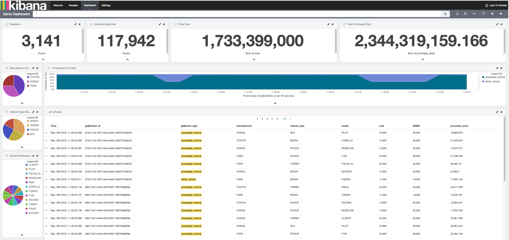

# Gumshoe Demo Application
This application generates some random vehicle sales data, then aggregates it
by manufacturer, type and model and displays its output.  It has been sprinkled
with Gumshoe goodness to allow event outputting to the gumshoe.log file.  These
are then forwarded to elasticsearch using FileBeat.  You can search and
visualize the event data in elasticsearch using kibana.  To see this in action,
do the following:

1. Open a terminal and run ```docker-compose up```.  This will bring up
Elasticsearch, FileBeat and Kibana.
2. Open a web browser and navigate to kibana:
  1. Get the IP address of the Docker machine:
  ```docker-machine env | grep 'export DOCKER_HOST'```. This should return a
  TCP address, like ```tcp://192.168.99.100:2376```. That ```192.168.99.100```
  is what we want.
  2. Navigate to port ```5601``` of that IP address in your web browser. For
  example, if ```192.168.99.100``` is the machine's IP, then Kibana is located
  at ```192.168.99.100:5601```.
3. Specify the index for kibana as ```gumshoe-*``` and use ```gs$emitted_at```
as the timestamp
4. Import the ```ops/kibana_export.json``` file from the settings > objects
tab in kibana.
5. Open the Demo Dashboard in kibana.
6. Run the application with ```VEHICLES=[some number] mvn exec:java```
7. Watch the kibana dashboard to see the events stream by


